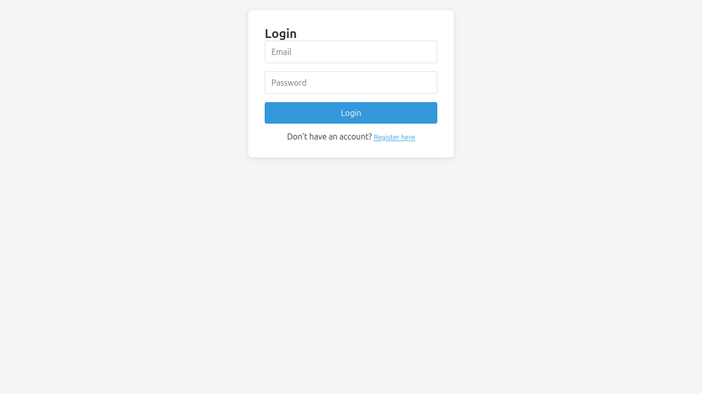
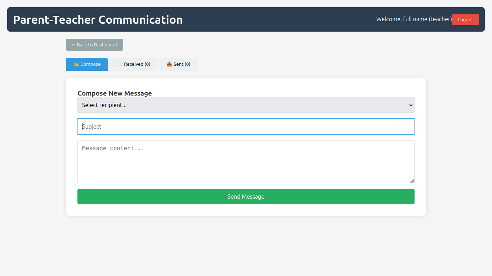
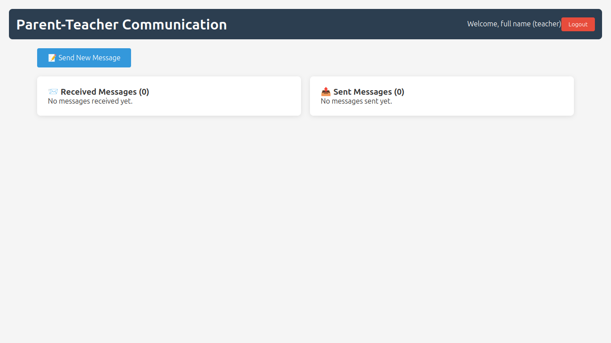

# 🎓 Parent-Teacher Communication Portal


A secure, full-stack MERN application designed to facilitate seamless communication between parents and teachers. Features include Role-Based Access Control (RBAC), secure JWT authentication, and a real-time password strength validation system.

---

## ✨ Key Features
* **Role-Based Access Control (RBAC):** Distinct dashboards and permissions for 'Parents' and 'Teachers'.
* **Robust Authentication:** Secure user registration and login using encrypted passwords (`bcryptjs`) and session management (`JSON Web Tokens`).
* **Advanced Form Validation:** Real-time frontend validation including a dynamic password strength meter.
* **Internal Messaging System:** Compose, send, and track received/sent messages within the platform.
* **Responsive UI:** Clean, modern, and user-friendly interface built with React.

---

## 📸 Project Screenshots

### 1. User Registration (with Password Strength Meter)


### 2. Secure Login


### 3. User Dashboard


### 4. Messaging Interface


---

## 🛠️ Tech Stack
* **Frontend:** React.js, CSS3 (Custom responsive UI)
* **Backend:** Node.js, Express.js
* **Database:** MongoDB, Mongoose ODM
* **Security & Auth:** JWT (JSON Web Tokens), bcryptjs

---

## 🚀 Setup Instructions

### Prerequisites
* Node.js installed on your local machine
* MongoDB installed locally or MongoDB Atlas URI

### Installation Steps

1. **Clone the repository:**
   ```bash
   git clone [https://github.com/niteshsrivastava993/parent-teacher-app.git](https://github.com/niteshsrivastava993/parent-teacher-app.git)
   cd parent-teacher-app